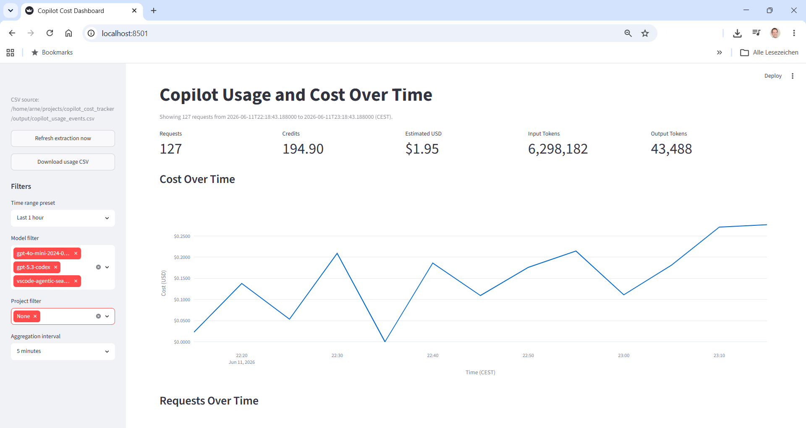

# Copilot Cost Tracker

Small Python project to extract GitHub Copilot Chat usage from VS Code debug logs and visualize costs over time.

## What it does

- Scans Copilot session logs and builds a usage CSV.
- Captures tokens, credits, estimated USD, timestamps, and (when found) project path/name.
- Shows an interactive Streamlit dashboard with time, model, and project filters.

## Requirements

- Python 3.12+
- `uv`

## Setup

```bash
uv sync
```

## VS Code Settings Prerequisite

To generate the Copilot debug logs used by this tool, add the following to your VS Code settings.json:

```json
"github.copilot.chat.agentDebugLog.enabled": true,
"github.copilot.chat.agentDebugLog.fileLogging.enabled": true
```

## Extract Usage CSV

```bash
uv run python scripts/extract_copilot_usage.py
```

Output is written to:

- `output/copilot_usage_events.csv`

## Run Dashboard

```bash
uv run streamlit run dashboard.py
```

In the dashboard:

- Use **Refresh extraction now** to regenerate the CSV.
- Download the current CSV via **Download usage CSV**.

## Screenshot



## Notes

- `project_path` and `project_name` are inferred from request text and may be `None` if missing in logs.
- **Cost calculation**: Uses `copilotUsageNanoAiu` from VS Code logs (pre-calculated by Copilot API). This field already accounts for token pricing differences, including cached token discounts. Token counts (`inputTokens`, `outputTokens`, `cachedTokens`) are extracted for visibility but do not drive cost calculations.
- Costs are estimated from `copilotUsageNanoAiu` using `$0.01` per credit.
